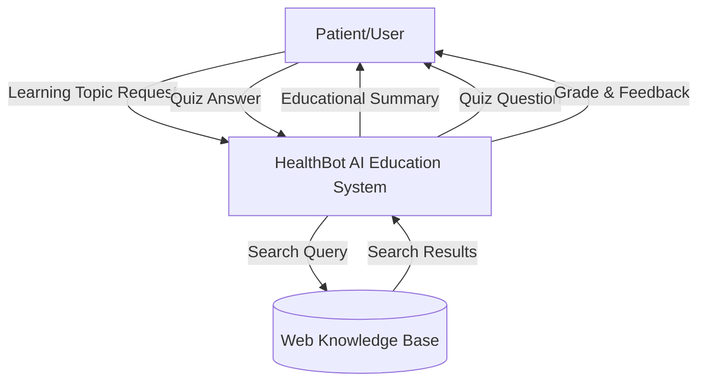
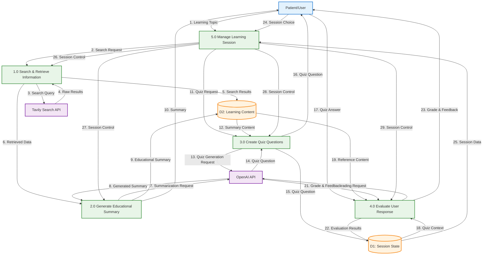

# Project Instructions

Create a LangGraph workflow that consists of nodes and edges that allow for the following functionality:

* [ ] Ask the patient what health topic or medical condition they'd like to learn about.
* [ ] Have the agent search Tavily using the LangChain community tool for Tavily, focusing on reputable medical sources.
* [ ] Have the agent summarize the Tavily results in patient-friendly language.
* [ ] Present the summarization to the patient and allow them to read it.
* [ ] Prompt the patient to indicate they are ready to take a comprehension check.
* [ ] Have the agent create a one question quiz based on the summarization of the health information.
* [ ] Present the quiz question to the patient.
* [ ] Prompt the patient to enter the answer to the quiz question.
* [ ] Have the agent grade the quiz question. The agent should respond with a grade, as well as a justification for why the grade was given, which should include citations from the health information summary.
* [ ] Present the grade and feedback to the patient.
* [ ] Ask the patient if they'd like to learn about a new health topic or if they want to exit the HealthBot session.
* [ ] Start the flow over again or exit. If the flow is started over again, you will need to reset the state so previous health information isn't carried over to maintain patient privacy and accuracy.

For patient input, you should use Jupyter notebook's `input` function, which will display a modal input with a description and text input to the patient. For displaying output to the patient, you can use the `print` function.

## **Conceptual Level DFD (Level 0)**

This high-level view shows:
- **Patient/User** as the external entity
- **HealthBot AI Education System** as the single main process
- **Web Knowledge Base** as the external data source
- Basic data flows showing the overall system interaction

## **Logical Level DFD (Level 1)**

This detailed view breaks down the main process into five core processes:

### **Core Processes:**
1. **Search & Retrieve Information (1.0)** - Handles Tavily API calls and data retrieval
2. **Generate Educational Summary (2.0)** - Uses OpenAI to create patient-friendly summaries
3. **Create Quiz Questions (3.0)** - Generates assessment questions based on summaries
4. **Evaluate User Response (4.0)** - Grades answers and provides feedback
5. **Manage Learning Session (5.0)** - Controls workflow and user choices

### **Data Stores:**
- **D1: Session State** - Maintains current session data, quiz context, and user progress
- **D2: Learning Content** - Stores retrieved information and generated summaries

### **External Systems:**
- **Tavily Search API** - Provides web search capabilities
- **OpenAI API** - Handles AI-powered text generation and analysis

### **Key Data Flows:**
- 29 numbered data flows showing the complete information exchange
- Clear separation between user interactions, API calls, and internal data management
- Feedback loops for session management and workflow control

This logical level demonstrates how the LangGraph nodes, state management, and API integrations work together to deliver the educational experience described in your project requirements.